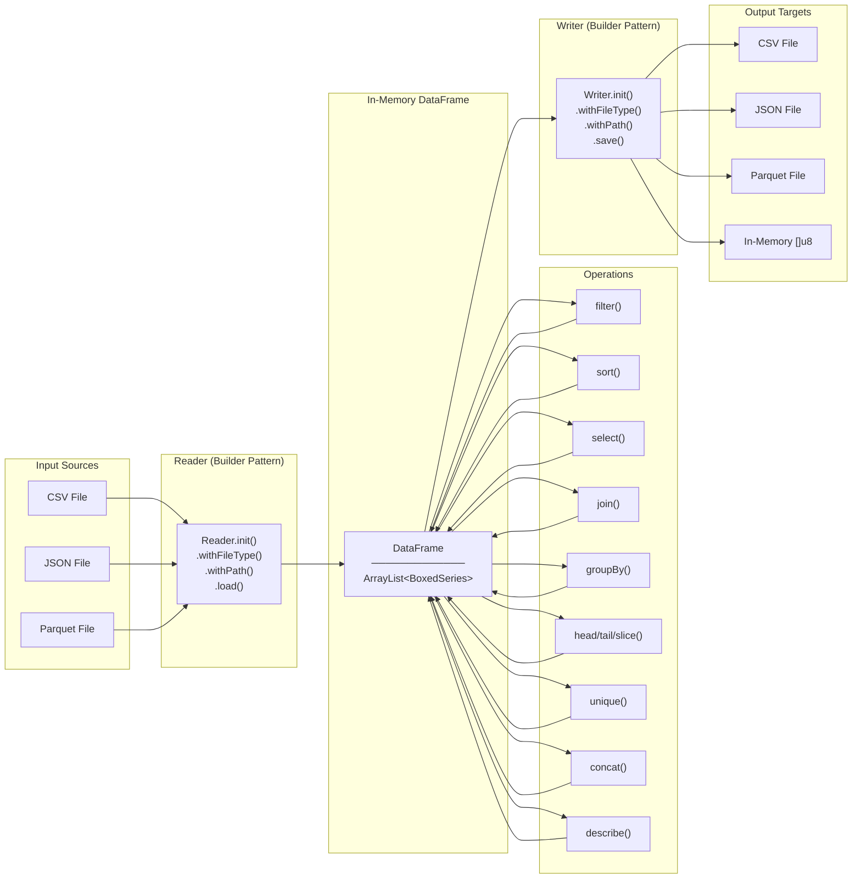
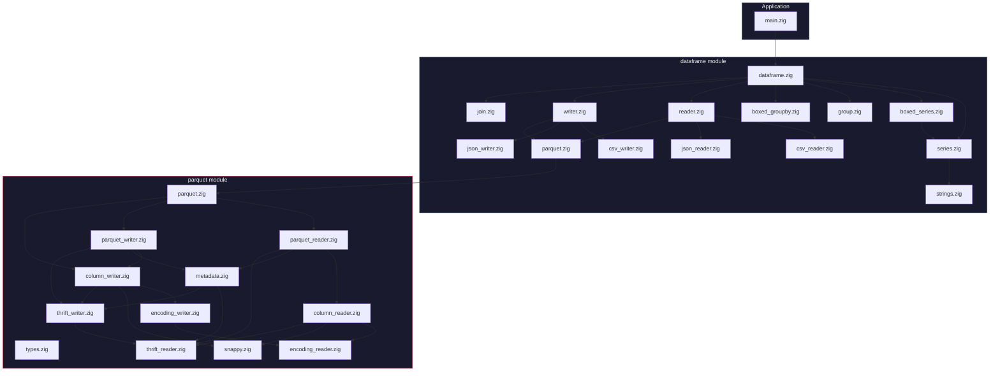

# Teddy Architecture Overview

## High-Level Data Flow



## Module Dependency Graph



## Project File Structure

```
teddy/
├── build.zig                    # Build configuration
├── data/                        # Sample data files
│   ├── addresses.csv
│   └── addresses.parquet
├── src/
│   ├── main.zig                 # Entry point
│   │
│   ├── dataframe/               # Core DataFrame module
│   │   ├── dataframe.zig        # DataFrame struct & operations
│   │   ├── series.zig           # Series(T) generic column
│   │   ├── boxed_series.zig     # Type-erased BoxedSeries union
│   │   ├── strings.zig          # Custom String type
│   │   ├── group.zig            # GroupBy(T) typed impl
│   │   ├── boxed_groupby.zig    # Type-erased BoxedGroupBy union
│   │   ├── join.zig             # Join operations
│   │   ├── reader.zig           # Unified file reader
│   │   ├── writer.zig           # Unified file writer
│   │   ├── csv_reader.zig       # CSV parser
│   │   ├── csv_writer.zig       # CSV serializer
│   │   ├── json_reader.zig      # JSON parser
│   │   ├── json_writer.zig      # JSON serializer
│   │   └── parquet.zig          # Parquet <-> DataFrame adapter
│   │
│   └── parquet/                 # Native Parquet implementation
│       ├── parquet.zig          # Module public API
│       ├── parquet_reader.zig   # Parquet file reader
│       ├── parquet_writer.zig   # Parquet file writer
│       ├── column_reader.zig    # Column chunk decoder
│       ├── column_writer.zig    # Column chunk encoder
│       ├── metadata.zig         # Thrift metadata structs
│       ├── types.zig            # Parquet type definitions
│       ├── encoding_reader.zig  # PLAIN/RLE decoders
│       ├── encoding_writer.zig  # PLAIN encoder
│       ├── thrift_reader.zig    # Thrift Compact decoder
│       ├── thrift_writer.zig    # Thrift Compact encoder
│       └── snappy.zig           # Snappy compress/decompress
└── docs/
    └── (this file)
```
