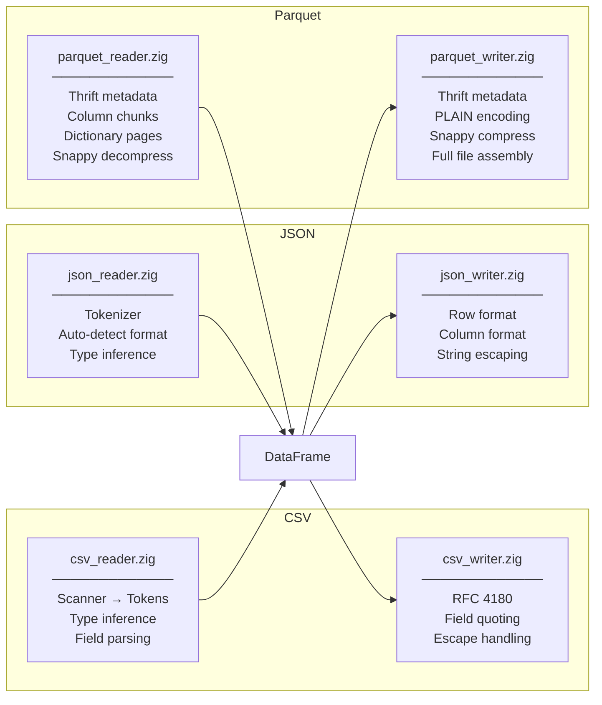
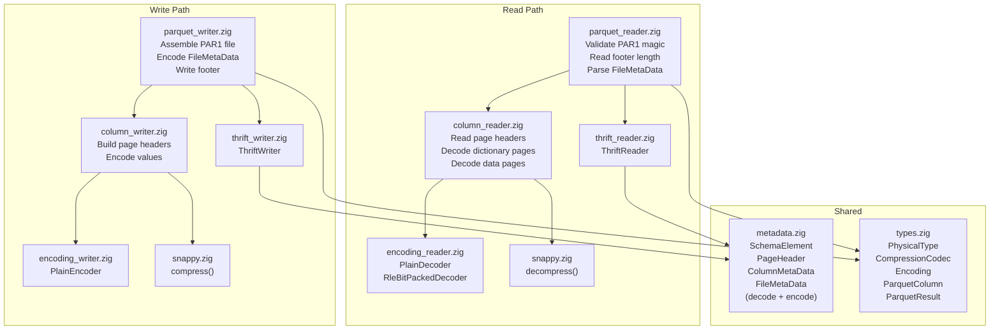

# File Format Support

## Format Comparison



## CSV Format

### Reading

```
Options:
  delimiter:  u8    (default: ',')
  has_header: bool  (default: true)
  skip_rows:  usize (default: 0)

Type Inference Pipeline:
  Raw bytes → Scanner → Tokens → Field values → Type detection → Series

Type Detection (per column):
  1. Try parse as integer → i64
  2. Try parse as float   → f64
  3. Fallback             → String
```

### Writing

```
Options:
  delimiter:      u8   (default: ',')
  include_header: bool (default: true)

Quoting Rules:
  - Fields containing delimiter, quote, or newline are quoted
  - Quotes inside fields are escaped: " → ""
```

### Example

```
Input CSV:                          DataFrame:
┌──────────────────────────┐        ┌──────┬─────┬────────┐
│ Name,Age,City            │   →    │ Name │ Age │ City   │
│ Alice,30,NYC             │        ├──────┼─────┼────────┤
│ Bob,25,LA                │        │Alice │  30 │ NYC    │
└──────────────────────────┘        │Bob   │  25 │ LA     │
                                    └──────┴─────┴────────┘
                                    String   i64   String
```

## JSON Format

### Two Layouts

```
ROW FORMAT (array of objects):        COLUMN FORMAT (object of arrays):
┌─────────────────────────────┐       ┌──────────────────────────────┐
│ [                           │       │ {                            │
│   {"Name":"Alice","Age":30},│       │   "Name": ["Alice", "Bob"],  │
│   {"Name":"Bob","Age":25}   │       │   "Age": [30, 25]            │
│ ]                           │       │ }                            │
└─────────────────────────────┘       └──────────────────────────────┘
        ↕                                       ↕
    ┌──────┬─────┐                        ┌──────┬─────┐
    │ Name │ Age │                        │ Name │ Age │
    ├──────┼─────┤  Same DataFrame  ←→    ├──────┼─────┤
    │Alice │  30 │                        │Alice │  30 │
    │Bob   │  25 │                        │Bob   │  25 │
    └──────┴─────┘                        └──────┴─────┘
```

### Type Inference

```
JSON value     →  Series type
─────────────────────────────
integer (42)   →  i64
float (3.14)   →  f64
string ("abc") →  String
true/false     →  bool
null           →  default (0 / false / "")

Mixed column rules:
  int + float  →  f64 (promote)
  any + string →  String (fallback)
```

## Parquet Format

### File Layout

```
┌────────────────────────────────────────┐
│ "PAR1"  (4 bytes magic)                │
├────────────────────────────────────────┤
│ Column Chunk 0                         │
│   ┌─ Page Header (Thrift encoded) ───┐ │
│   │  page_type: DATA_PAGE            │ │
│   │  uncompressed_size               │ │
│   │  compressed_size                 │ │
│   │  DataPageHeader:                 │ │
│   │    num_values, encoding          │ │
│   └──────────────────────────────────┘ │
│   ┌─ Page Data ──────────────────────┐ │
│   │  PLAIN encoded values            │ │
│   │  (optionally Snappy compressed)  │ │
│   └──────────────────────────────────┘ │
├────────────────────────────────────────┤
│ Column Chunk 1                         │
│   (same structure)                     │
├────────────────────────────────────────┤
│ ...                                    │
├────────────────────────────────────────┤
│ Footer (Thrift encoded FileMetaData)   │
│   version: 2                           │
│   schema: [root, col0, col1, ...]      │
│   num_rows                             │
│   row_groups: [{columns, sizes}]       │
│   created_by: "teddy (Zig)"            │
├────────────────────────────────────────┤
│ Footer Length (4 bytes LE u32)         │
├────────────────────────────────────────┤
│ "PAR1"  (4 bytes magic)                │
└────────────────────────────────────────┘
```

### Parquet Read/Write Stack



### Compression Support

```
Codec          Read    Write   Notes
───────────────────────────────────────
Uncompressed   Yes     Yes     Default
Snappy         Yes     Yes     Literal-only compression
GZIP           No      No      Future
LZ4            No      No      Future
ZSTD           No      No      Future
```
