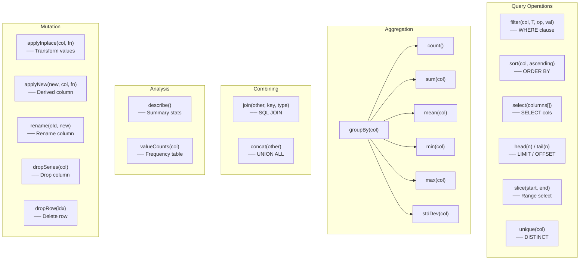

# DataFrame Operations & Examples

## Operations Overview



## Filter

SQL equivalent: `SELECT * FROM df WHERE Age >= 30`

```zig
const filtered = try df.filter("Age", i64, .gte, 30);
defer filtered.deinit();
```

```
CompareOp:  .eq  .neq  .lt  .lte  .gt  .gte

Input:                              Output:
┌──────┬─────┐                      ┌──────┬─────┐
│ Name │ Age │                      │ Name │ Age │
├──────┼─────┤                      ├──────┼─────┤
│Alice │  30 │  ── Age >= 30 ──→    │Alice │  30 │
│Bob   │  25 │                      │Carol │  45 │
│Carol │  45 │                      └──────┴─────┘
└──────┴─────┘

String filter:
const filtered = try df.filter("City", []const u8, .eq, "NYC");
```

## Sort

SQL equivalent: `SELECT * FROM df ORDER BY Age ASC`

```zig
const sorted = try df.sort("Age", true);  // true = ascending
defer sorted.deinit();
```

```
Input:                              Output (ascending):
┌──────┬─────┐                      ┌──────┬─────┐
│ Name │ Age │                      │ Name │ Age │
├──────┼─────┤                      ├──────┼─────┤
│Carol │  45 │  ── sort Age ──→     │Bob   │  25 │
│Alice │  30 │                      │Alice │  30 │
│Bob   │  25 │                      │Carol │  45 │
└──────┴─────┘                      └──────┴─────┘
```

## Select

SQL equivalent: `SELECT Name, City FROM df`

```zig
const projected = try df.select(&.{ "Name", "City" });
defer projected.deinit();
```

```
Input:                              Output:
┌──────┬─────┬──────┐              ┌──────┬──────┐
│ Name │ Age │ City │              │ Name │ City │
├──────┼─────┼──────┤  ── select   ├──────┼──────┤
│Alice │  30 │ NYC  │     ──→      │Alice │ NYC  │
│Bob   │  25 │ LA   │              │Bob   │ LA   │
└──────┴─────┴──────┘              └──────┴──────┘
```

## GroupBy + Aggregation

SQL equivalent: `SELECT City, COUNT(*) FROM df GROUP BY City`

```zig
var gb = try df.groupBy("City");
defer gb.deinit();
var counts = try gb.count();
defer counts.deinit();
```

```
Input:                              count():
┌──────┬──────┐                     ┌──────┬───────┐
│ Name │ City │                     │ City │ count │
├──────┼──────┤                     ├──────┼───────┤
│Alice │ NYC  │   ── groupBy ──→    │ NYC  │     2 │
│Bob   │ LA   │      count()        │ LA   │     1 │
│Carol │ NYC  │                     └──────┴───────┘
└──────┴──────┘

Available aggregations:
┌────────────────────────────────────────────────────────┐
│  count()        → key + count (usize)                  │
│  sum("col")     → key + sum (same type as col)         │
│  mean("col")    → key + mean (always f64)              │
│  min("col")     → key + min (same type as col)         │
│  max("col")     → key + max (same type as col)         │
│  stdDev("col")  → key + std_dev (always f64)           │
└────────────────────────────────────────────────────────┘
```

## Join

SQL equivalent: `SELECT * FROM left JOIN right ON left.id = right.id`

```zig
const joined = try left.join(right, "id", .inner);
defer joined.deinit();
```

```
JoinType: .inner  .left  .right  .outer

Left:               Right:              Inner Join on "id":
┌────┬──────┐       ┌────┬───────┐      ┌────┬──────┬───────┐
│ id │ Name │       │ id │ Score │      │ id │ Name │ Score │
├────┼──────┤       ├────┼───────┤      ├────┼──────┼───────┤
│  1 │Alice │       │  1 │    90 │      │  1 │Alice │    90 │
│  2 │Bob   │       │  3 │    85 │      └────┴──────┴───────┘
│  3 │Carol │       └────┴───────┘
└────┴──────┘                           Left Join on "id":
                                        ┌────┬──────┬───────┐
                                        │ id │ Name │ Score │
                                        ├────┼──────┼───────┤
                                        │  1 │Alice │    90 │
                                        │  2 │Bob   │     0 │
                                        │  3 │Carol │    85 │
                                        └────┴──────┴───────┘
```

## Head / Tail / Slice

```zig
const first3 = try df.head(3);
const last2  = try df.tail(2);
const middle = try df.slice(1, 4);  // rows [1, 4)
```

```
Input (5 rows):                head(2):        tail(2):        slice(1, 3):
┌────┐                         ┌────┐           ┌────┐          ┌────┐
│ r0 │                         │ r0 │           │ r3 │          │ r1 │
│ r1 │                         │ r1 │           │ r4 │          │ r2 │
│ r2 │                         └────┘           └────┘          └────┘
│ r3 │
│ r4 │
└────┘
```

## Unique

SQL equivalent: `SELECT DISTINCT ON (City) * FROM df`

```zig
const uniq = try df.unique("City");
defer uniq.deinit();
```

```
Input:                              Output (first occurrence):
┌──────┬──────┐                     ┌──────┬──────┐
│ Name │ City │                     │ Name │ City │
├──────┼──────┤                     ├──────┼──────┤
│Alice │ NYC  │  ── unique ──→      │Alice │ NYC  │
│Bob   │ LA   │    ("City")         │Bob   │ LA   │
│Carol │ NYC  │                     └──────┴──────┘
└──────┴──────┘
```

## Concat

SQL equivalent: `SELECT * FROM df1 UNION ALL SELECT * FROM df2`

```zig
const combined = try df1.concat(df2);
defer combined.deinit();
```

```
df1:                    df2:                    concat(df1, df2):
┌──────┬─────┐          ┌──────┬─────┐          ┌──────┬─────┐
│ Name │ Age │          │ Name │ Age │          │ Name │ Age │
├──────┼─────┤          ├──────┼─────┤          ├──────┼─────┤
│Alice │  30 │    +     │Dave  │  28 │    =     │Alice │  30 │
│Bob   │  25 │          └──────┴─────┘          │Bob   │  25 │
└──────┴─────┘                                  │Dave  │  28 │
                                                └──────┴─────┘
```

## Describe

SQL equivalent: Summary statistics per numeric column.

```zig
const stats = try df.describe();
defer stats.deinit();
```

```
Input:                              Output:
┌──────┬─────┬───────┐             ┌──────┬─────────┬──────────┐
│ Name │ Age │  Zip  │             │ stat │   Age   │   Zip    │
├──────┼─────┼───────┤             ├──────┼─────────┼──────────┤
│Alice │  30 │ 10001 │   ──→       │count │       3 │        3 │
│Bob   │  25 │ 90001 │             │mean  │   33.33 │ 53334.33 │
│Carol │  45 │ 60001 │             │std   │   10.41 │ 40000.33 │
└──────┴─────┴───────┘             │min   │      25 │    10001 │
                                   │max   │      45 │    90001 │
  (String columns excluded)        └──────┴─────────┴──────────┘
```

## Apply (Transform)

```zig
// In-place: double all ages
df.applyInplace("Age", i64, struct {
    fn f(x: i64) i64 { return x * 2; }
}.f);

// New column: create "AgePlus10"
try df.applyNew("AgePlus10", "Age", i64, struct {
    fn f(x: i64) i64 { return x + 10; }
}.f);
```

```
Before:                             After applyInplace(Age, *2):
┌──────┬─────┐                      ┌──────┬─────┐
│ Name │ Age │                      │ Name │ Age │
├──────┼─────┤                      ├──────┼─────┤
│Alice │  30 │         ──→          │Alice │  60 │
│Bob   │  25 │                      │Bob   │  50 │
└──────┴─────┘                      └──────┴─────┘
```
