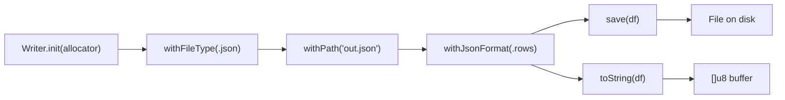
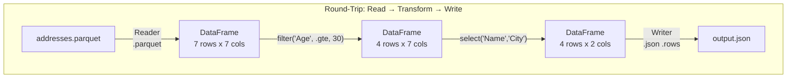

# Reader & Writer API

## Reader Builder Pattern


### Reader Options by Format

```
┌─────────────────────────────────────────────────────────────────┐
│                         Reader                                  │
├─────────────┬───────────────┬───────────────┬───────────────────┤
│   Option    │     CSV       │    JSON       │    Parquet        │
├─────────────┼───────────────┼───────────────┼───────────────────┤
│ fileType    │ .csv          │ .json         │ .parquet          │
│ path        │ Required      │ Required      │ Required          │
│ delimiter   │ ',' default   │ (ignored)     │ (ignored)         │
│ has_header  │ true default  │ (ignored)     │ (ignored)         │
│ skip_rows   │ 0 default     │ (ignored)     │ (ignored)         │
└─────────────┴───────────────┴───────────────┴───────────────────┘
```

### Reader Examples

```zig
// CSV with defaults
var df = try reader.withFileType(.csv)
    .withPath("data.csv")
    .load();

// CSV with semicolon delimiter, no header
var df = try reader.withFileType(.csv)
    .withPath("data.csv")
    .withDelimiter(';')
    .withHeaders(false)
    .load();

// JSON (auto-detects row vs column format)
var df = try reader.withFileType(.json)
    .withPath("data.json")
    .load();

// Parquet
var df = try reader.withFileType(.parquet)
    .withPath("data.parquet")
    .load();
```

## Writer Builder Pattern



### Writer Options by Format

```
┌─────────────────────────────────────────────────────────────────┐
│                         Writer                                  │
├─────────────┬───────────────┬───────────────┬───────────────────┤
│   Option    │     CSV       │    JSON       │    Parquet        │
├─────────────┼───────────────┼───────────────┼───────────────────┤
│ fileType    │ .csv          │ .json         │ .parquet          │
│ path        │ For save()    │ For save()    │ For save()        │
│ delimiter   │ ',' default   │ (ignored)     │ (ignored)         │
│ header      │ true default  │ (ignored)     │ (ignored)         │
│ jsonFormat  │ (ignored)     │ .rows default │ (ignored)         │
│ compression │ (ignored)     │ (ignored)     │ .uncompressed     │
└─────────────┴───────────────┴───────────────┴───────────────────┘
```

### Writer Examples

```zig
// CSV to file
var w = try Writer.init(allocator);
defer w.deinit();
_ = w.withFileType(.csv).withPath("output.csv");
try w.save(df);

// JSON to string (rows format)
_ = w.withFileType(.json).withJsonFormat(.rows);
const json = try w.toString(df);
defer allocator.free(json);

// JSON to string (columns format)
_ = w.withFileType(.json).withJsonFormat(.columns);
const json = try w.toString(df);

// Parquet with snappy compression
_ = w.withFileType(.parquet).withCompression(.snappy);
const bytes = try w.toString(df);

// Parquet to file
_ = w.withFileType(.parquet).withPath("output.parquet");
try w.save(df);
```

## Convenience Methods on DataFrame

These are shortcuts that bypass the Writer builder:

```zig
// CSV string
const csv_str = try df.toCsvString(.{ .delimiter = ',' });
defer allocator.free(csv_str);

// JSON string
const json_str = try df.toJsonString(.rows);
defer allocator.free(json_str);
```

## Round-Trip Diagram



```zig
// Full round-trip example
var r = try dataframe.Reader.init(allocator);
defer r.deinit();
var df = try r.withFileType(.parquet)
    .withPath("data/addresses.parquet")
    .load();
defer df.deinit();

const filtered = try df.filter("Age", i64, .gte, 30);
defer filtered.deinit();

const projected = try filtered.select(&.{ "First Name", "City" });
defer projected.deinit();

var w = try dataframe.Writer.init(allocator);
defer w.deinit();
_ = w.withFileType(.json)
    .withJsonFormat(.rows)
    .withPath("output.json");
try w.save(projected);
```
