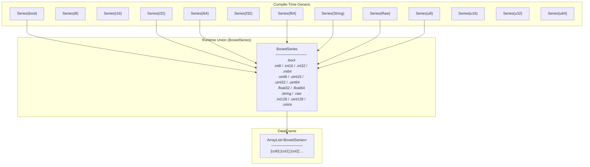
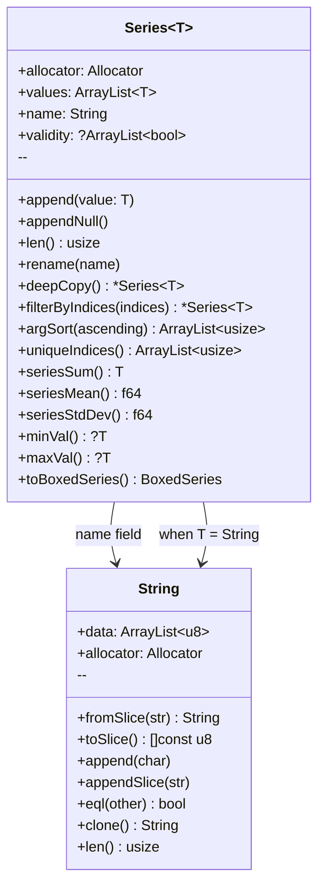

# Teddy Type System

## Type Erasure Pattern

Teddy uses compile-time generics wrapped in runtime unions to support multiple column types efficiently.



## Value-Type Capability Convention (Phase 6d-2a.0)

`Series(T)` no longer hard-codes `T == String` special-cases. Instead, a value
type opts into ownership/printing/metadata semantics by **declaring methods**,
detected at comptime via `hasMethod(T, name)` (`series.zig` — a
`@typeInfo`-gated `@hasDecl`, so primitives safely report false):

| Decl | Drives | Who declares it |
|---|---|---|
| `deinit()` | element cleanup in deinit/dropRow/limit | owning types (String, Raw) |
| `clone()` | deep copy in deepCopy/filter/fillNull/shift/replace/join | owning types |
| `eql(other)` | compareSeries/replace match, GroupBy/join hashing equality | String, Raw |
| `toSlice()` | argSort ordering, GroupBy/join hashing | String, Raw |
| `init(allocator)` | the appendNull placeholder (others use `std.mem.zeroes(T)`) | owning types |
| `format(writer)` | `{f}` rendering in print/asStringAt (Raw → lowercase hex) | display-custom types |
| `type_name` | display label (`getTypeAsString`, print header) | non-primitive types |
| `ColumnMeta` | column-level metadata struct stored at `Series(T).meta` | Raw (preserved parquet types) |

Numeric behavior is **not** capability-keyed: `is_numeric` comes from
`@typeInfo` (`.int`/`.float`), so a future `f16` column participates in
aggregations with no declarations, and struct types are automatically
excluded. `BoxedSeries` dispatch arms are comptime-guarded on
`is_numeric`/`is_castable`/`is_groupable`, so adding a union variant can never
force-instantiate an unsupported method (it returns `error.TypeNot*` instead).

`Raw` (`raw.zig`) is the fallback column type for parquet payloads teddy does
not decode yet (INT96 until slice 6d-2a.2; VARIANT/GEOMETRY/GEOGRAPHY/nested
until 6d-2b): owned bytes per value + `Series(Raw).meta` carrying the
preserved physical type and annotations, so files round-trip bit-faithfully.

## Series(T) Internal Structure



## Supported Type Mappings

```
┌──────────────┬───────────────┬───────────────┬────────────────┐
│  Zig Type    │  BoxedSeries  │  Parquet      │  Display Name  │
├──────────────┼───────────────┼───────────────┼────────────────┤
│  bool        │  .bool        │  BOOLEAN      │  Bool          │
│  i8          │  .int8        │  INT32+int_8  │  Int8          │
│  i16         │  .int16       │  INT32+int_16 │  Int16         │
│  i32         │  .int32       │  INT32        │  Int32         │
│  i64         │  .int64       │  INT64        │  Int64         │
│  u8          │  .uint8       │  INT32+uint_8 │  UInt8         │
│  u16         │  .uint16      │  INT32+uint16 │  UInt16        │
│  u32         │  .uint32      │  INT32+uint_32│  UInt32        │
│  u64         │  .uint64      │  INT64+uint_64│  UInt64        │
│  f32         │  .float32     │  FLOAT        │  Float32       │
│  f64         │  .float64     │  DOUBLE       │  Float64       │
│  String      │  .string      │  BYTE_ARRAY   │  String        │
│  Raw         │  .raw         │  (preserved)* │  Raw           │
└──────────────┴───────────────┴───────────────┴────────────────┘

* Raw re-emits whatever physical type + logical/converted annotation the
  column carried on read (INT96, FLBA(n), BYTE_ARRAY+VARIANT, ...), stored in
  `Series(Raw).meta`. Reader-side resolution precedence (modern logical_type →
  legacy converted_type → bare physical) lives in `resolveKind`
  (src/dataframe/parquet.zig).
```
